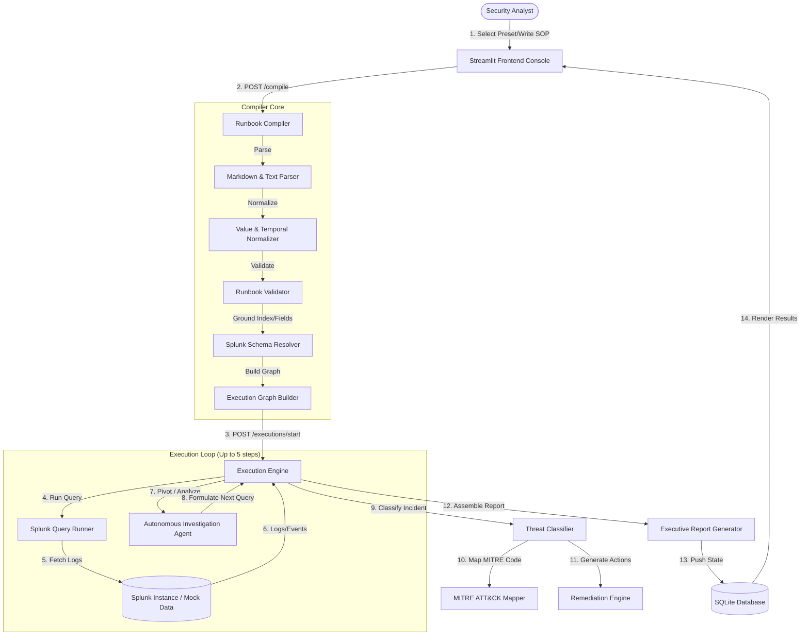

# RunbookMind: AI Security Investigation Copilot

RunbookMind is an autonomous AI Security Investigation Copilot that converts static, unstructured SOC runbooks (SOPs) into executable investigation workflows, executes them against log targets (like Splunk), autonomously pivots to track threat footprints, maps techniques to MITRE ATT&CK, and produces executive-ready incident reports.

---

## 🌟 Key Features

*   **SOP-to-Workflow Compilation**: Parses unstructured Markdown runbooks and compiles them into structured execution graphs containing query nodes and automated/governed actions.
*   **Autonomous Closed-Loop Investigator**: An AI Analyst agent that iteratively executes queries, analyzes results, and dynamically generates next-step pivot queries (up to 5 steps) to trace malicious footprints.
*   **Real-time Splunk Schema Grounding**: Translates natural-language sources (e.g. `auth_logs` or `endpoint`) into actual Splunk indices/sourcetypes (e.g. `index=main sourcetype=security_logs`), case-insensitively aligning query filters with available index fields.
*   **Threat Intelligence & MITRE ATT&CK Mapping**: Classifies threats, determines risk scores (0-100), and correlates signatures (e.g. Mimikatz, encoded PowerShell) to MITRE technique codes (`T1003`, `T1059.001`, `T1547.001`, `T1136`).
*   **Remediation Recommendation Engine**: Automatically generates actionable recommendations across Containment, Eradication, Recovery, and Prevention.
*   **Executive Report Generator**: Automatically produces executive-ready markdown reports summarizing key threat findings, affected assets, collected evidence, and remediation plans.
*   **Stunning Security Console**: A clean, focused Streamlit dashboard visualizing runbook compilation, live execution timelines, active threat intelligence boards, interactive investigator chat, and reports.

---

## 🏗️ System Architecture & Data Flow

RunbookMind uses a structured architecture to convert unstructured text into automated security workflows. The diagram below illustrates the end-to-end data flow from runbook upload to executive reporting.



---

## 📂 Project Directory Structure

```
RunbookMind/
├── app/
│   ├── agent/
│   │   ├── compiler.py             # Orchestrates runbook-to-workflow compilation
│   │   ├── governance.py           # Governance policies (AUTO vs MANUAL execution)
│   │   ├── graph.py                # Graph, Node, and Action models
│   │   ├── index_resolver.py       # Maps natural language sources to Splunk indices
│   │   ├── investigation_agent.py   # Multi-hop pivoting planner (Claude / Rule-based)
│   │   ├── mitre_mapper.py         # Maps security threats to MITRE ATT&CK IDs
│   │   ├── remediation.py          # Actionable remediation engine
│   │   ├── threat_classifier.py    # Classifies threats, risk scores, and severities
│   │   └── summary.py              # Compiles findings into Markdown executive reports
│   │
│   ├── domain/
│   │   ├── enums.py                # ActionType, StepType, and Approval enums
│   │   └── models.py               # Runbook, Step, and Compilation Pydantic schemas
│   │
│   ├── generation/
│   │   └── engine.py               # Translates step requirements to concrete SPL queries
│   │
│   ├── parser/
│   │   ├── markdown_parser.py      # Parses markdown headings, lists, and metadata
│   │   ├── text_parser.py          # Parses plaintext lines into structured steps
│   │   └── normalizer.py           # Standardizes timeframes and status keywords
│   │
│   ├── runtime/
│   │   ├── engine.py               # Asynchronous workflow loop executor
│   │   ├── models.py               # Database execution record and job state schemas
│   │   ├── query_results.py        # Structured Splunk query outputs
│   │   └── runner.py               # Executes SPL queries against Splunk targets
│   │
│   ├── schema/
│   │   └── provider.py             # Grounding service for available index fields
│   │
│   ├── ui/
│   │   └── app.py                  # Interactive Streamlit frontend dashboard
│   │
│   └── web/
│       ├── routes.py               # REST API endpoints for compilation and monitoring
│       └── main.py                 # FastAPI application startup & routing
│
├── tests/                          # Extensive unit & integration test suite
│   ├── test_compiler.py
│   ├── test_investigation.py
│   ├── test_templates.py
│   └── ...
├── runbookmind.db                  # In-memory/SQLite database for execution tracking
├── pyproject.toml                  # Project packaging and metadata
└── README.md                       # Comprehensive system documentation
```

---

## ⚡ Core Integration Details

### 1. Splunk Schema Grounding & Resolution
Rather than creating hardcoded or abstract queries, RunbookMind queries are grounded in your actual Splunk environment schema:
*   **Index Mapping**: Maps logical data sources to physical Splunk indices and sourcetypes:
    *   `auth_logs` $\rightarrow$ `index=main sourcetype=security_logs`
    *   `endpoint` $\rightarrow$ `index=main sourcetype=endpoint_logs`
    *   `network` $\rightarrow$ `index=main sourcetype=network_traffic`
*   **Field Alignment**: Queries are validated against known fields fetched dynamically from the `MockSchemaProvider` (e.g. `["host", "user", "process", "parent_process", "action", "severity", "status", "src_ip"]`). If a field is not available in the schema, the engine automatically aligns the SPL filters to avoid query execution failures.

### 2. Autonomous Closed-Loop Pivoting
When the execution engine launches, it runs steps in the graph. If a query yields zero results, or if suspicious details (like an IP address or user account) are discovered:
*   The `InvestigationAgent` initiates a closed-loop analysis.
*   If Claude API keys are configured, it invokes Claude to reason over the results and issue a pivot query.
*   If unconfigured, it falls back to a deterministic rule-based planner (`_fallback_pivot`) to trace processes (`mimikatz.exe`, `powershell.exe`, `net.exe`, `reg.exe`) across `host` $\rightarrow$ `user` $\rightarrow$ `parent_process` to track threat propagation.

### 3. Governance Gates
To ensure safety in production environments, the engine evaluates governance constraints:
*   **Execution Modes**:
    *   **AUTO**: Purely read-only investigation and mapping queries execute autonomously.
    *   **MANUAL**: Active actions (e.g., blocking an IP address, resetting a password) require explicit human approval via the dashboard before the node can execute.
*   **Smart Upgrades**: The compiler upgrades a step to `MANUAL` only if explicit approval keywords (e.g., `"approve"`, `"gate"`, `"confirm"`, `"signoff"`) are detected.

---

## 🚀 Quick Start & Usage

### 1. Installation
Install project dependencies in your environment:
```bash
pip install -e .[dev]
```

### 2. Start the FastAPI API Server
Start the backend web server:
```bash
uvicorn app.web.main:app --reload --port 8000
```

### 3. Start the Streamlit Security Console
Run the interactive frontend dashboard:
```bash
streamlit run app/ui/app.py
```
Open [http://localhost:8501](http://localhost:8501) in your browser to view the console.

### 4. Running the Test Suite
To verify the entire code changes are functionally sound and passing:
```bash
python -m pytest
```

---

## 📝 Demo Walkthrough Guide

1.  **Select a Preset**: In the Streamlit sidebar, select a prebuilt template (e.g. **Credential Dumping**).
2.  **Compile Runbook**: Click the **Compile Runbook** button. The graph visualizer will display nodes, actions, data source scopes, and computed governance metadata.
3.  **Start Investigation**: Click **Start Investigation**. Watch the live execution progress timeline transition from `QUEUED` $\rightarrow$ `RUNNING` $\rightarrow$ `COMPLETED`.
4.  **Threat Intelligence Board**: View the classified threat type (e.g. `Credential Dumping`), risk score (`99`), and mapped MITRE technique (`T1003`).
5.  **Executive Report**: Download or read the final generated report outlining the findings, evidence, and remediation suggestions.