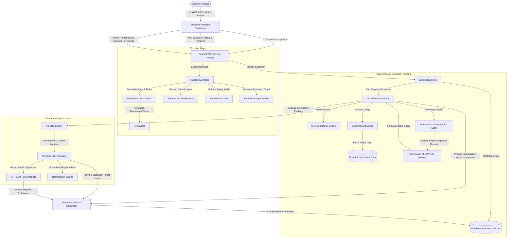

# RunbookMind Architecture Diagram & Flow

This document details the system architecture, component boundaries, and end-to-end data flow of the RunbookMind platform.

---

## Architecture Flow Diagram

---

## Architectural Components

### 1. Ingestion & Compiler Layer
*   **Markdown / Text Parsers**: Decomposes unstructured operational text files into raw Pydantic domain models (`Runbook`, `RunbookStep`).
*   **Normalizer**: Evaluates relative time strings (e.g. `"in 5 min"`, `"within 1 hour"`) and status conditions into deterministic timeframes and standard filter schemas.
*   **Splunk Index Resolver**: Maps natural-language data sources (e.g. `auth_logs`, `endpoint`, `network`) to corresponding Splunk indices/sourcetypes.
*   **Execution Graph Builder**: Analyzes step dependencies and builds a directed acyclic graph (DAG) representation of the workflow.

### 2. Governance & Policy Engine
*   **Governance Policy**: Inspects compiled steps to assign appropriate execution modes:
    *   `AUTO`: Non-destructive queries (e.g., searches, status checks) are executed autonomously.
    *   `MANUAL`: Active containment actions (e.g., blocking an IP address, resetting accounts) require explicit user approval.
*   **Approval Gates**: Steps requiring verification or approval are automatically flagged with `MANUAL` execution status.

### 3. Execution Runtime & Autonomous Pivoting
*   **Execution Engine**: Runs the asynchronous event loop to process node execution. It monitors node status transitions (`QUEUED` $\rightarrow$ `RUNNING` $\rightarrow$ `COMPLETED` / `FAILED`).
*   **Autonomous Investigation Agent**: Evaluates the retrieved query output. If results are empty or contain critical threat clues, it initiates autonomous closed-loop pivoting (up to 5 steps) to gather additional context.
*   **Splunk Query Runner**: Interface layer that compiles parameters into standard Splunk Search Processing Language (SPL) and executes requests against target Splunk environments.

### 4. Threat Intelligence Layer
*   **Threat Classifier**: Evaluates the cumulative investigation history and raw events to classify incident types (e.g. Credential Dumping, Obfuscated PowerShell, Persistence, Account Creation), severity levels, and risk scores.
*   **MITRE ATT&CK Mapper**: Correlates threat types with official MITRE Technique IDs (such as `T1003` for Credential Dumping and `T1059.001` for Obfuscated PowerShell).
*   **Remediation Engine**: Produces a structured action playbook detailing Containment, Eradication, Recovery, and Prevention steps tailored to the classified threat.

### 5. Report Assembly
*   **Summary Generator**: Assembles the timeline of events, query queries executed, results count, MITRE techniques, evidence metadata, and remediation steps into a polished Markdown Executive Report.
